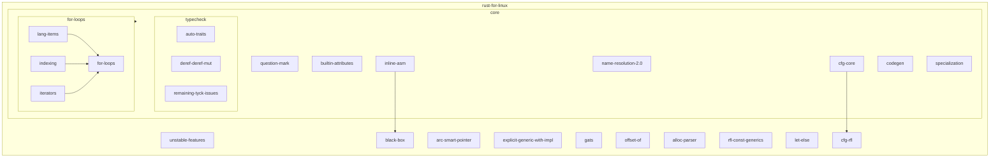
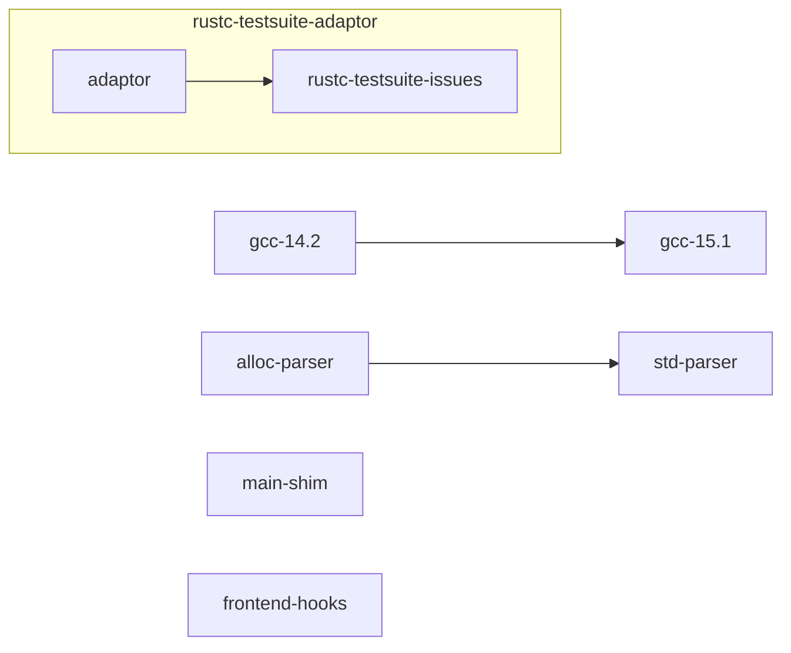

## Introduction

The aim of this document is to serve as semi-live engineering preview of what we aim to achieve for `gccrs` in the coming year(s), and in what timeline. What "semi-live" means is that we aim to update this document as we progress and close off milestones, which should hopefull reflect our progress in the coming months.

The shape of this document is very rough, as it served as a starting point to establish our [Github milestones](https://github.com/rust-GCC/gccrs/milestones). We have used it as a way to estimate the time of each task, which allowed us to create a dependency graph and gantt chart with expected deadlines as well as starting dates for each of the milestones.

This gives us a rough outline of when we expect the compiler to be able to be used as a general purpose compiler, or when we can start experimenting with `gccrs` for compiling the Rust parts of the Linux kernel, and other important milestones.

As a reminder, the main development focus for this year is the handling of *correct* Rust code, and more specifically the 1.49 version of the `core` crate. Once that is achieved, we will shift our focus towards compiling the `alloc` crate, which will enable us to start working towards the compilation of the Rust-for-Linux project.

## Content

🟢 🟠 🔴

## Goals for 15.1

We need to prioritize and milestone-ize what is absolutely *needed* for compiling `core` and `RfL`. For example, [Issue 2032](https://github.com/Rust-GCC/gccrs/issues/2732) concerns invalid Rust code that should be checked against, but that is not present in either `core` or `RfL` as these two projects only contain *valid* Rust code - hence, it is low priority and will not appear on this document.

### Rust for Linux

We want to be able to provide an experimentation platform for RfL developers. This means that the compiler may not be completely able to compile RfL, but at least able to be experimented with.

This requires `core` support.

### `core` support

Supporting the entire `core` library is necessary in order to be useful for the RfL project, as well as the rest of the ecosystem. This will enable us to start looking at the `alloc` crate, another crate used by the RfL project, as well as the rest of `std` for regular userland Rust code.

<details>
  <summary>Mermaid graph code</summary>




  
</details>


## Milestones

### GCC 14.2

We will be able to add small changes to GCC 14.2, mainly non-technical ones. This milestone should only concern documentation changes, or other small non-technical items.

|Issue                                 |Step|Est. Time|Completed?|
|--------------------------------------|----|---------|:--------:|
|github.com/Rust-GCC/gccrs/issues/2050 |N/A |1 weeks  |🔴        |

### RfL unstable features

__NOTE__: Some of the required features are not used upstream ATM, so we might be able to reduce that list/split it in two

https://github.com/Rust-for-Linux/linux/issues/2

Some of the tasks listed above are not Rust language features but rather features used by the RfL project as a whole - things like command-line options for `rustc`, or functions in `core`.

We need to be able to support these functions, and to implement equivalent command-line options.

By grepping in the `RfL` codebase, it seems that not that many nightly features are actually used (as of 2024-05-13). An updated list for those unstable features can be found [here](https://github.com/Rust-for-Linux/linux/issues/2)

https://rust-lang.github.io/rust-project-goals/2024h2/rfl_stable.html

|Issue                                 |Step|Est. Time|Completed?|
|--------------------------------------|----|---------|:--------:|
|Handle `SmartPointer` derive macro*   |Exp |6 weeks  |🔴        |
|Mutable references in const contexts  |HIR |3 weeks  |🔴        |
|`impl Trait` in associated/alias type |HIR |5 weeks  |🔴        |

\* this one may not be necessary as it is being replaced by other features

### `black_box` hint function

At the moment, this function is implemented using the `llvm_asm!()` builtin macro, which we need to figure out how to handle in `Inline assembly`. Note that in later versions of the language, `black_box` becomes an intrinsic function - we need to be able to handle that properly as well.

|Issue                                 |Step|Est. Time|Completed?|
|--------------------------------------|----|---------|:--------:|
|Handle `hint::black_box<T>`           |Cg  |1 month  |🔴        |

### Explicit generic argument with `impl Trait` in function signature

https://github.com/rust-lang/rust/issues/83701

This feature is disallowed in Rust 1.49, but required for RfL.

|Issue                                 |Step|Est. Time|Completed?|
|--------------------------------------|----|---------|:--------:|
|[Code example](https://play.rust-lang.org/?version=stable&mode=debug&edition=2021&gist=bc4296eb79460834bec636ae59bc14de)            |Tyk |1 month  |🔴        |

### Generic Associated Types

https://github.com/rust-lang/rfcs/pull/1598

|Issue                                 |Step|Est. Time|Completed?|
|--------------------------------------|----|---------|:--------:|
|Handle GATs                           |Cg  |N/A      |🔴        |
|github.com/Rust-GCC/gccrs/issues/1726 |Tyk |N/A      |🔴        |

### `offset_of!` builtin macro

|Issue                                 |Step|Est. Time|Completed?|
|--------------------------------------|----|---------|:--------:|
|Add support for `offset_of!()`        |Exp |6 weeks  |🔴        |
|Add support for nested fields         |Exp |3 weeks  |🔴        |

### `#[cfg]` handling - core 1.49

|Issue                                 |Step|Est. Time|Completed?|
|--------------------------------------|----|---------|:--------:|
|github.com/Rust-GCC/gccrs/issues/3018 |Prs |5 days   |🔴        |
|github.com/Rust-GCC/gccrs/issues/2983 |AST |2 weeks  |🔴        |
|github.com/Rust-GCC/gccrs/issues/2984 |AST |2 weeks  |🔴        |

### `#[cfg]` handling - RfL

There might be complex `cfg` invocations in Rust-for-Linux, so we will need to be able to parse and handle all of them properly. This milestone will be developped in time as it is hard to get visibility on the topic. However, our existing `cfg`-handling pass is pretty complete, so this should not take a lot of time - probably a month or so.

### `let-else`

`let-else` is stable in Rust since 1.65, so much later than the Rust version we target. However, they are already in use in the RfL project: grepping for `'let .* else '` gives the following hits:

```rust
// rust/macros/paste.rs:29                
let Some(TokenTree::Ident(ident)) = tokens.next() else {
 
// rust/macros/helpers.rs:170
let Some(name) = toks.next() else {
```

This will require extensive modifications to the parser, AST, HIR, type system and codegen - so almost all steps of our compiler pipeline.

Note that the last issue in this table is about the `let-else` feature in general and concerns all of the issues mentioned above it.

|Issue                                 |Step|Est. Time|Completed?|
|--------------------------------------|----|---------|:--------:|
|Parse `let-else` statements           |Prs |2 weeks  |🔴        |
|Add `let-else` AST node               |AST |3 days   |🔴        |
|Name resolve `let-else` nodes         |NR  |1 days   |🔴        |
|Macro expand `let-else` nodes         |Exp |1 days   |🔴        |
|Add `let-else` HIR node               |HIR |3 days   |🔴        |
|Typecheck `let-else` nodes            |Tyk |2 weeks  |🔴        |
|Codegen `let-else` nodes              |CG  |2 weeks  |🔴        |
|github.com/Rust-GCC/gccrs/issues/2915 |N/A |N/A      |🔴        |

### Question Mark operator

__NOTE__: This milestone will probably grow as it is not well-researched yet.

The `?` operator is used in `core` to propagate errors and for control flow. We need to desugar it properly (and probably to handle the `Try` family of traits as well).

|Issue                                 |Step|Est. Time|Completed?|
|--------------------------------------|----|---------|:--------:|
|Desugar question mark operator        |Low |1 months |🔴        |
|Handle `expr?` in all AST passes      |AST |2 weeks  |🔴        |
|Handle `Try` trait family             |Typ |8 weeks  |🔴        |

### `lang` items

|Issue                                 |Step|Est. Time|Completed?|
|--------------------------------------|----|---------|:--------:|
|Support `#[lang]` qualified paths NR  |NR  |2 weeks  |🔴        |
|Support `#[lang]` qualified paths HIR |HIR |2 weeks  |🔴        |
|Support `#[lang]` qualified paths Tyk |Tyk |3 weeks  |🔴        |

### `for`-loops

`for`-loops are required to support some of the functions implemented in `core`. We are running into issues with name resolution as well as type resolution to fully support them.

This will enable us to finally close [Issue 682](https://github.com/Rust-GCC/gccrs/issues/682) regarding the blake3 algorithm.

|Issue                                 |Step|Est. Time|Completed?|
|--------------------------------------|----|---------|:--------:|
|github.com/Rust-GCC/gccrs/issues/2877 |Tyk |1 month  |🔴        |
|github.com/Rust-GCC/gccrs/issues/2905 |Tyk |1 month  |🔴        |
|github.com/Rust-GCC/gccrs/issues/2906 |CG  |2 weeks  |🔴        |
|github.com/Rust-GCC/gccrs/issues/2907 |Tyk |1 month  |🔴        |
|github.com/Rust-GCC/gccrs/issues/682  |N/A |N/A      |🔴        |

### Specialization

`core` requires some form of specialization to be present for optimization reasons. We need to be able to handle this subset of the feature, at least to select the proper trait methods that Rust expects. However, since specialization is used *solely* for optimization purposes, and that all implementations should be equivalent, we should be able to ignore specialized versions of a function and simply pick the most generic one, at least for `core`.

|Issue                                 |Step|Est. Time|Completed?|
|--------------------------------------|----|---------|:--------:|
|Handle required min. specialization   |HIR |2 months |🔴        |

### Inline assembly

This work will be done as part of a Google Summer of Code project.

|Issue                                 |Step|Est. Time|Completed?|
|--------------------------------------|----|---------|:--------:|
|github.com/Rust-GCC/gccrs/issues/1566 |HIR |3 months |🔴        |
|github.com/Rust-GCC/gccrs/issues/1796 |Exp |1 weeks  |🔴        |
|github.com/Rust-GCC/gccrs/issues/1797 |Exp |1 days   |🔴        |
|github.com/Rust-GCC/gccrs/issues/1798 |Exp |1 days   |🔴        |
|github.com/Rust-GCC/gccrs/issues/1569 |HIR |1 weeks  |🔴        |

With a start of the work around the beginning of June, I think we can have inline assembly implemented completely by the beginning of September. This feature should be usable by August.

### Indexing/Slices
### Iterators

There are issues around the various indexing and iterator traits defined in `core` which we need to investigate and fix. These are necessary for handling `for`-loops.

### `alloc` parser issues

There are still parsing issues left to fix in order to completely compile `alloc` 1.49. We need to collect these issues precisely and fix them in time for 15.1.

There are no more parser issues for `core` 1.49 thanks to @Pierre-Emmanuel, so this milestone only concerns code needed by RfL and the standard library. As such, this milestone can be handled later in the year.

|Issue                                 |Step|Est. Time|Completed?|
|--------------------------------------|----|---------|:--------:|
|Parse `#[may_dangle]` attribute       |Prs |1 weeks  |🔴        |
|Parse `box` keyword                   |Prs |1 weeks  |🔴        |
|Parse `raw` keyword                   |Prs |1 weeks  |🔴        |

### `std` parser issues

Issues in the parser when trying to compile `std` 1.49.

|Issue                                 |Step|Est. Time|Completed?|
|--------------------------------------|----|---------|:--------:|
|github.com/Rust-GCC/gccrs/issues/2984 |Prs |3 weeks  |🔴        |


### Unhandled attributes

Attributes used in `core`, `alloc`, `std` or RfL which we need to add handling for.

|Issue                                 |Step|Est. Time|Completed?|
|--------------------------------------|----|---------|:--------:|
|`#[may_dangle]` type attribute        |N/A |N/A      |🔴        |
|Handle `#[prelude_import]` attribute  |NR  |2 weeks  |🔴        |

### Macro expansion

Similarly, there are probably expansion issues when running the compiler on `core` 1.49 which will need to be addressed. They might however highlight other issues, such as name resolution, in which case they should not be part of this milestone.

|Issue                                 |Step|Est. Time|Completed?|
|--------------------------------------|----|---------|:--------:|
|github.com/Rust-GCC/gccrs/issues/2987 |Exp |4 weeks  |🔴        |
|github.com/Rust-GCC/gccrs/issues/2988 |Exp |3 weeks  |🔴        |
|github.com/Rust-GCC/gccrs/issues/2989 |Exp |3 weeks  |🔴        |
|github.com/Rust-GCC/gccrs/issues/2990 |Exp |3 weeks  |🔴        |
|github.com/Rust-GCC/gccrs/issues/2991 |Exp |3 weeks  |🔴        |
|github.com/Rust-GCC/gccrs/issues/2992 |Exp |3 weeks  |🔴        |
|github.com/Rust-GCC/gccrs/issues/2993 |Exp |2 weeks  |🔴        |
|github.com/Rust-GCC/gccrs/issues/2994 |Exp |5 weeks  |🔴        |
|github.com/Rust-GCC/gccrs/issues/2995 |Exp |2 weeks  |🔴        |
|github.com/Rust-GCC/gccrs/issues/2996 |Exp |2 weeks  |🔴        |
|github.com/Rust-GCC/gccrs/issues/2015 |Exp |1 weeks  |🔴        |

### Name resolution 2.0

We have two name resolution algorithm in the project.
- The "old" one is incomplete and cannot perform a correct name resolution.
    - Its structure is unsuited for rust.
    - It has several bugs and cannot even name resolve the requirements for our mini standard library.
- The new name resolution algorithm "name resolution 2.0"
    - Incomplete and not used by default

We need to fix the new name resolution algorithm and fix all regressions. Once complete we need to enable it by default. This milestone is extremely important, as we currently cannot name-resolve `core` 1.49 properly. All other `core` milestones are thus "dependent" on this one in order to compile `core` properly in its entirety, without singling out modules or code examples.

|Issue                                 |Step|Est. Time|Completed?|
|--------------------------------------|----|---------|:--------:|
|github.com/Rust-GCC/gccrs/issues/2935 |NR  |3 weeks  |🔴        |
|github.com/Rust-GCC/gccrs/issues/2939 |NR  |1 weeks  |🔴        |
|github.com/Rust-GCC/gccrs/issues/2934 |NR  |2 days   |🔴        |
|github.com/Rust-GCC/gccrs/issues/2933 |NR  |3 weeks  |🔴        |
|github.com/Rust-GCC/gccrs/issues/2986 |NR  |3 weeks  |🔴        |
|github.com/Rust-GCC/gccrs/issues/1579 |NR  |1 weeks  |🔴        |
|github.com/Rust-GCC/gccrs/issues/3007 |NR  |3 weeks  |🔴        |
|github.com/Rust-GCC/gccrs/issues/2997 |NR  |3 weeks  |🔴        |
|github.com/Rust-GCC/gccrs/issues/2999 |NR  |3 days   |🔴        |
|github.com/Rust-GCC/gccrs/issues/3000 |NR  |2 weeks  |🔴        |
|github.com/Rust-GCC/gccrs/issues/3001 |NR  |1 weeks  |🔴        |
|github.com/Rust-GCC/gccrs/issues/3015 |NR  |3 weeks  |🔴        |
|github.com/Rust-GCC/gccrs/issues/3016 |NR  |3 weeks  |🔴        |
|github.com/Rust-GCC/gccrs/issues/3022 |NR  |2 weeks  |🔴        |
|github.com/Rust-GCC/gccrs/issues/3023 |NR  |3 days   |🔴        |
|github.com/Rust-GCC/gccrs/issues/3024 |NR  |3 days   |🔴        |
|github.com/Rust-GCC/gccrs/issues/3026 |NR  |3 days   |🔴        |
|github.com/Rust-GCC/gccrs/issues/3027 |NR  |3 days   |🔴        |
|github.com/Rust-GCC/gccrs/issues/3028 |NR  |3 days   |🔴        |
|github.com/Rust-GCC/gccrs/issues/3029 |NR  |3 days   |🔴        |
|github.com/Rust-GCC/gccrs/issues/3035 |NR  |2 weeks  |🔴        |
|github.com/Rust-GCC/gccrs/issues/3036 |NR  |3 weeks  |🔴        |
|github.com/Rust-GCC/gccrs/issues/3037 |NR  |3 days   |🔴        |
|github.com/Rust-GCC/gccrs/issues/3038 |NR  |3 days   |🔴        |
|github.com/Rust-GCC/gccrs/issues/3040 |NR  |3 days   |🔴        |
|github.com/Rust-GCC/gccrs/issues/2089 |NR  |3 days   |🔴        |
|github.com/Rust-GCC/gccrs/issues/3042 |NR  |3 days   |🔴        |

__NOTE__: Should we fix some bits in name resolution 1.0 in order to compile the mini standard library? Probably not but this means we need to default to 2.0 soon.

### Typecheck

__NOTE__: This needs to be split into sub milestones one for each big category of typecheck bugs

|Issue                                 |Step|Est. Time|Completed?|
|--------------------------------------|----|---------|:--------:|
|github.com/Rust-GCC/gccrs/issues/3039 |Typ |2 weeks  |🔴        |

### Improve `auto` traits handling

`auto` traits are essential to Rust, as they mark very intrinsic functionality of the runtime. Linked to them are negative impls, which, while unstable, are important for the Rust language and used throughout `core`. We need to handle them properly and completely in our trait solver.

|Issue                                 |Step|Est. Time|Completed?|
|--------------------------------------|----|---------|:--------:|
|github.com/Rust-GCC/gccrs/issues/3030 |Typ |2 weeks  |🔴        |
|github.com/Rust-GCC/gccrs/issues/3008 |Typ |3 weeks  |🔴        |

### Improve `Deref` and `DerefMut` handling

These two traits are absolutely *essential* to the Rust programming language, but we currently run into some very specific and hard-to-debug issues with their implementation in `core` 1.49.

|Issue                                 |Step|Est. Time|Completed?|
|--------------------------------------|----|---------|:--------:|
|github.com/Rust-GCC/gccrs/issues/3032 |Typ |2 weeks  |🔴        |
|github.com/Rust-GCC/gccrs/issues/3033 |Typ |6 weeks  |🔴        |

### Remaining typechecking issues for `core`

|Issue                                 |Step|Est. Time|Completed?|
|--------------------------------------|----|---------|:--------:|
|github.com/Rust-GCC/gccrs/issues/3031 |Typ |3 weeks  |🔴        |

### Codegen

### Borrow checking error improvements

Another GSoC project for this year, which aims to improve the user experience when running the experimental borrow-checking algorithm in `gccrs`.

### Borrow checking

### RfL Const Generics (as of 2024-05-13)

Grepping for `'<.*const.*>'` gives the following hits:

```rust
kernel/init.rs
1020:pub fn init_array_from_fn<I, const N: usize, T, E>(
1064:pub fn pin_init_array_from_fn<I, const N: usize, T, E>(
1333:    {<const N: usize, T: Zeroable>} [T; N], {<T: Zeroable>} Wrapping<T>,

kernel/workqueue.rs
 178:    pub fn enqueue<W, const ID: u64>(&self, w: W) -> W::EnqueueOutput
 271:pub unsafe trait RawWorkItem<const ID: u64> {
 315:pub unsafe trait WorkItemPointer<const ID: u64>: RawWorkItem<ID> {
 330:pub trait WorkItem<const ID: u64 = 0> {
 351:pub struct Work<T: ?Sized, const ID: u64 = 0> {
 360:unsafe impl<T: ?Sized, const ID: u64> Send for Work<T, ID> {}
 364:unsafe impl<T: ?Sized, const ID: u64> Sync for Work<T, ID> {}
 366:impl<T: ?Sized, const ID: u64> Work<T, ID> {
 435:pub unsafe trait HasWork<T, const ID: u64 = 0> {
 521:unsafe impl<T, const ID: u64> WorkItemPointer<ID> for Arc<T>
 538:unsafe impl<T, const ID: u64> RawWorkItem<ID> for Arc<T>
 566:unsafe impl<T, const ID: u64> WorkItemPointer<ID> for Pin<Box<T>>
 585:unsafe impl<T, const ID: u64> RawWorkItem<ID> for Pin<Box<T>>
```

It seems that the required const generics only concern "simple" types, e.g. `u64` and `usize`. So unstable const generic features do not seem to be required.

The milestone will concern adding testcases for those functions and ensuring const generics are handled properly in those cases. It will also be a nice time for us to clean up our implementation and make sure the code is in a nice state.

### `main` shim

This is not "required" for RfL or `core`, but it is for real user code.

### Const generics 2

__NOTE__: What to do here? what do we need to add in Const Generics 2?

### Frontend hooks for GCC plugins

[Milestone link](https://github.com/Rust-GCC/gccrs/milestone/32)

[Project link](https://github.com/orgs/Rust-GCC/projects/20)

### GCC 15.1 top-level patches

* Build system improvements
* Anything else?
* Windows/MinGW patches?
 
|Issue                                 |Step|Est. Time|Completed?|
|--------------------------------------|----|---------|:--------:|
|Upstream checks for `-ldl -lpthread`  |N/A |1 weeks  |🟢        |
|Add makefile rules for documentations |N/A |1 weeks  |🔴        |

These need to be done early so that they cannot be rejected for 15.1 due to lack of time.

__NOTE__: Add this to risk table?

### Adapting the `rustc` testsuite

This GSoC project concerns the adaptation of the `rustc` testsuite in order to run it using `gccrs` as a compiler.

### Testsuite issues

Issues raised by running the `rustc` testsuite under gccrs.

## Milestone table

|Milestone|Start Date|Target Date|
|---|---|---|
|Name resolution 2.0                | 1st Jun 2024| 1st Apr 2025|
|GCC 14.2                           | 7th Jun 2024|15th Jun 2024|
|GCC 15.1                           |21st Jun 2024| 1st Jul 2024|
|Macro expansion                    | 1st Jun 2024| 1st Jan 2025|
|Unhandled attributes               | 1st Jul 2024|15th Aug 2024|
|Lang items                         | 1st Jul 2024| 1st Sep 2024|
|Indexing fixes                     |21st Jun 2024|15th Sep 2024|
|Iterator fixes                     |21st Jun 2024|15th Sep 2024|
|Auto traits improvements           |15th Sep 2024|21st Oct 2024|
|Deref and DerefMut improvements    |28th Sep 2024|28th Oct 2024|
|Remaining typecheck issues         |21st Oct 2024| 1st Jan 2025|
|cfg-core                           | 1st Dec 2024| 1st Jan 2025|
|Question mark operator             |15th Dec 2024|21st Feb 2025|
|Codegen fixes                      | 7th Oct 2024| 1st Mar 2025|
|Specialization                     | 1st Jan 2025| 1st Mar 2025|
|[GSoC] Inline assembly             | 1st Jun 2024|15th Sep 2024|
|[GSoC] Borrow checker improvements | 1st Jun 2024|15th Sep 2024|
|[GSoC] Rustc Testsuite Adaptor     | 1st Jun 2024|15th Sep 2024|
|black_box intrinsic                |28th Oct 2024|28th Nov 2024|
|Unstable RfL features              | 7th Jan 2025| 1st Mar 2025|
|cfg-rfl                            | 7th Jan 2025|15th Feb 2025|
|alloc parser issues                | 7th Jan 2025|28th Jan 2025|
|let-else                           |28th Jan 2025|28th Feb 2025|
|Explicit generics with impl Trait  |28th Feb 2025|28th Mar 2025|
|offset_of!() builtin macro         |15th Mar 2025|15th May 2025|
|Generic Associated Types           |15th Mar 2025|15th Jun 2025|
|RfL const generics                 | 1st May 2025|15th Jun 2025|
|frontend plugin hooks              |15th May 2025| 7th Jul 2025|
|Handling the testsuite issues      |15th Sep 2024|15th Sep 2025|
|std parser issues                  |28th Jun 2025|28th Jul 2025|
|main shim                          |28th Jul 2025|15th Sep 2025|

## TODO
- Add existing issues to milestones for next year
- Create issues on repository for all tasks
