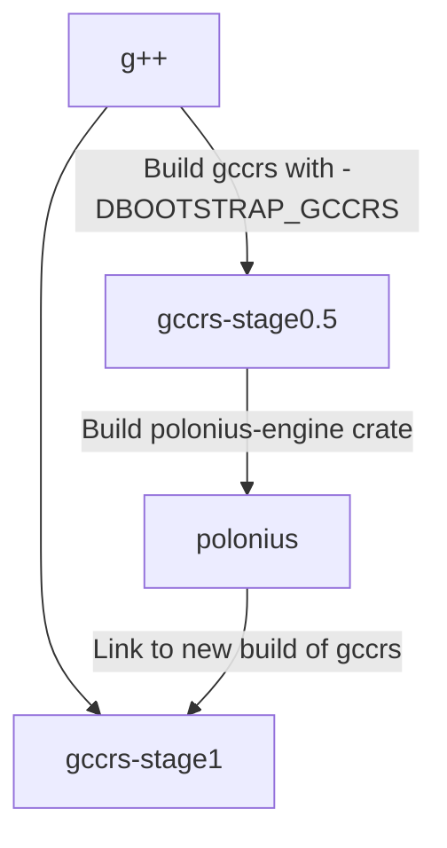

In order to speed up development, as well as make sure `gccrs` exposes the exact same behavior as `rustc` in critical compiler passes, we have decided 

_NOTE: Link to the RFC email_

1. Why
  1. To speed up development
  2. To make sure we are doing exactly the same thing as rustc in those cases
2. What components do we reuse
3. What do we plan on reusing?
  1. Trait solver eventually? as it's crucial and really complex
  2. Auto transmute work by Jack Wrenn -> ping on Zulip to get the name
  3. Why not reuse even more???
    - internal representations like our ASTs are different and ever-changing
    - why bother making another compiler if we are going to reuse everything? :eyes:
4. What does it mean to be the same as rustc for those components?
  1. borrow-checker: Have the exact same errors instead of subtle differences
  2. format-args-parser: Have the exact same internal representation to match with std's format module perfectly
5. How do we use them at the moment?
  1. We build them with cargo/rustc
6. How do we plan on using/compiling them?
  1. We first build gccrs without them
  2. We then use gccrs to build them and link to ourselves
7. Bootstrap diagram

We can then use `gccrs-stage1` to borrow-check the `polonius` crate, and ensure that it is valid in that regard - otherwise, exit the bootstrapping process.

_NOTE: Explain -DBOOTSTRAPPING_RUST_
_NOTE: Talk about how we can disable some passes like borrow-checking, but for others we'll have to use mocking or our own, less-complete implementation_

