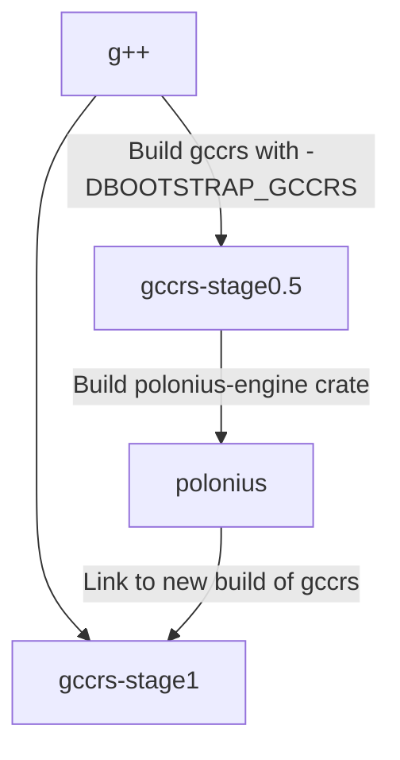

In order to speed up development, as well as make sure `gccrs` exposes the exact same behavior as `rustc` in critical compiler passes, we decided last year to start reusing components and crates from the official Rust compiler where possible. These components range from external crates used by the compiler for certain `nightly` options to internal `rustc` worskspace crates. As expected however, these components are written in Rust - which poses an interesting challenge for `gccrs` to use them. The goal of this blogpost is to explore some of these components, explain why we are reusing them, and talk about how they will be integrated into the compiler once it is more complete.

## Which components?

The first `rustc` component reused by `gccrs` was [`rustc_parse_format`](https://github.com/rust-lang/rust/tree/c22a4215a0f6fb676d3774d3763d9da1462414f5/compiler/rustc_parse_format), which we added at the beginning of the year in 2024. The role of this crate is to parse "Rust format strings" - which correspond to the various string templates used in string formatting and inline assembly. The role of that crate is to parse the template string, as well as each of the "pieces" used in the template string. For example, when looking at `println!("Hello {ferris}!")`, the parser will emit three "pieces" - two for the static strings `"Hello "` and `"!"`, and one for the named argument `ferris`. If you're thinking "Arthur, why didn't you just rewrite the parser, that sounds easy" well the answer is I am absolutely ass at writing parsers in C++. I need [`nom`](https://crates.io/crates/nom) or I can't function. Regardless, `rustc_parse_format` is a tiny `rustc` component, which in truth is not terribly difficult to implement. But tweaking the build system to allow the reuse of that component, as well as writing the various Rust <-> C++ interfaces needed for interacting with the `crate`, helped pave the way for the most crucial of the components we are currently reusing - `polonius`. `polonius` is the next generation Rust borrow-checker, and can alread be used on `rustc` with the nightly `-Z polonius` option. You can read more about polonius [here](https://rust-lang.github.io/polonius/).

We plan on adding more components to `rustc` in the future where _NOTE: Reword "it makes sense"_. For example, there are currently efforts towards making a new trait solver for `rustc` - if separate enough from the compiler, this could also be integrated and used by `gccrs` to do trait solving on the `gccrs` internal representation. Similarly, [Jack Wrenn](https://github.com/jswrenn) gave a fantastic talk at RustConf 2024 detailling checked-transmutes _NOTE: Add links to proposals, blogpost, etc_. Talking with Jack after his talk revealed that the algorithm powering checked-transmutes _NOTE: Use the actual term_ is quite separate from the compiler. It uses its own graph representation, which is built from `rustc`'s internal representation, but could also be built using `gccrs`'!

However, it is not possible to reuse any component we want from `rustc`. The two compilers' internal representations are extremely different, and converting back-and-forth from one to the other would be extremely costly.

_NOTE: Show block structure for AST?_

## Why is it important to be the exact same as rustc?

Borrow-checking is an extremely complex subject, and a core part of the Rust programming language. It is important that `gccrs` gets it right, and it is important for us not to introduce subtle differences with `rustc` for such a crucial error pass. Instead of rolling out our own borrow-checking algorithm, reusing one which will be used by `rustc` allows us to at least reduce the amount of differences we will introduce. Of course, we still need to be extremely careful when creating the information used by `polonius`, and to test the output extensively. But we already *know* that `polonius` itself has been tested extensively within `rustc`, and will continue to be tested once it gets integrated into the official compiler. This similar reasoning can be applied to the future trait-solver. For string templating, making sure that we get parsing right is important, as the compiler needs to emit code calling into Rust's standard library. By using the same parser algorithm, we can be sure that we generate the same runtime calls to the standard library's formatting module, thus helping us ensure users will have the same behavior with `rustc` and `gccrs` when using string formatting.

## How do we use them?

The components are written in Rust. We are writing a Rust compiler. Seems like we could just... reuse our project to compile these components? And yes, we can! But not just yet. At the moment, `gccrs` is still a work in progress compiler, and cannot compile a lot of real-world Rust code out there - including `rustc_parse_format` and `polonius-engine`. For this reason, we currently rely on `cargo` and `rustc` to compile these crates for us, and we then link them to our compiler at the end of the compilation process. Once `gccrs` is more complete, we plan to integrate these crates to our compiler using the following bootstrapping process:

First, we use a C++ compiler to build `gccrs`, disabling the borrow-checking pass of the compiler. It is important to ensure borrow-checking cannot be disabled at runtime using a command line flag, as this could have a negative impact on the Rust ecosystem - however, building `gccrs` without borrow-checking to use it as an intermediate compiler in our bootstrapping process is okay. Similarly, secret powers can be unlocked from `rustc` if you define certain environment variables, which among other things allow a stable compiler to compile the Rust standard library - which relies heavily on nightly Rust features.

Once this intermediate compiler is built, we use it to compile `polonius`. We can then use this crate and link it to `gccrs`, giving us a proper compiler with borrow-checking enabled. To make sure the `polonius` we have compiled is valid, we need to borrow-check the `polonius` crate itself, or exit the bootstrapping process if this fails.

Since this intermediate bootstrapping compiler will also be built without any of the Rust components we plan on using, it will be quite limited. For example, its string formatting capabilities

1. Why
  1. To speed up development
  2. To make sure we are doing exactly the same thing as rustc in those cases
2. What components do we reuse
3. What do we plan on reusing?
  1. Trait solver eventually? as it's crucial and really complex
  2. Auto transmute work by Jack Wrenn -> ping on Zulip to get the name
  3. Why not reuse even more???
    - internal representations like our ASTs are different and ever-changing
    - why bother making another compiler if we are going to reuse everything? :eyes:
4. What does it mean to be the same as rustc for those components?
  1. borrow-checker: Have the exact same errors instead of subtle differences
  2. format-args-parser: Have the exact same internal representation to match with std's format module perfectly
5. How do we use them at the moment?
  1. We build them with cargo/rustc
6. How do we plan on using/compiling them?
  1. We first build gccrs without them
  2. We then use gccrs to build them and link to ourselves
7. Bootstrap diagram

We can then use `gccrs-stage1` to borrow-check the `polonius` crate, and ensure that it is valid in that regard - otherwise, exit the bootstrapping process.

_NOTE: Explain -DBOOTSTRAPPING_RUST_
_NOTE: Talk about how we can disable some passes like borrow-checking, but for others we'll have to use mocking or our own, less-complete implementation_

